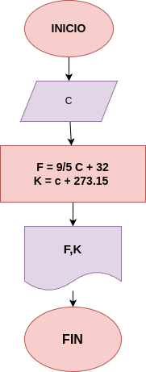

# CONVERTIR_GRADOS_C_EN_K_Y_F
CONVERTIR LOS GRADOS °C EN GRADOS °K Y GRADOS °F
# Variable de entrada
- Grados °C
# Procesamiento

- °F = (9/5*°C) + 32
- °K = °C + 273.15
# Diseño

# Construción
- codigo implementado en el archivo "CONVERTIR_GRADOS_C_EN_K_Y_F

